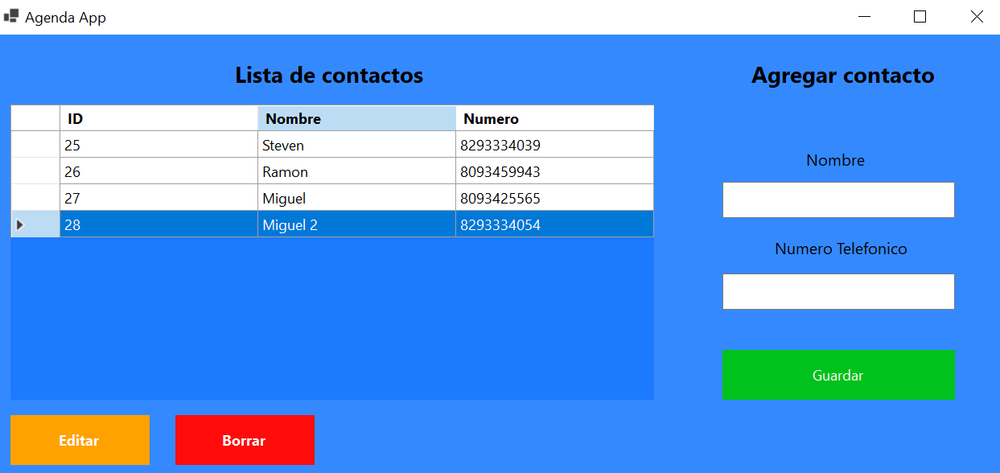

#Agenda App

*Una pequeña aplicación hecha en C# usando SQL Server como base de datos la cual es una Agenda para 
crear, leer, actualizar y borrar contactos, es mi primer CRUD usando .NET con C# y SQL Server como 
gestor de bases de datos.*

##Pasos para ejecutarla

1. Ejecuta las consultas e instrucciones que están en el archivo database.sql para crear la base de datos
   AGENDA y la tabla CONTACTOS.

2. Abre el proyecto en Visual Studio y ejecutalo.

